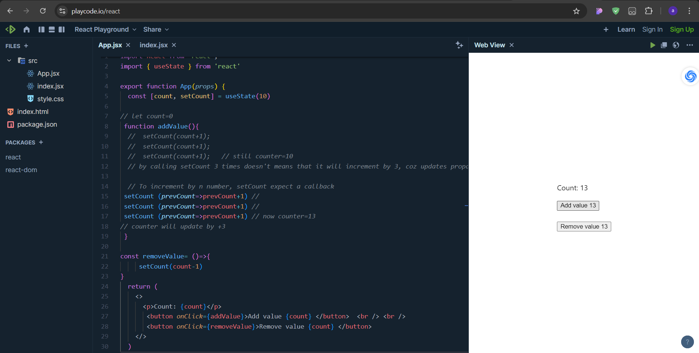

# Lec08: "A React Interview Question on Counter"                [YouTube](https://www.youtube.com/watch?v=bB6707XzCNc&list=PLu71SKxNbfoDqgPchmvIsL4hTnJIrtige&index=7).

## Screenshots



- The video covers a common React interview question about building a counter application with increment and decrement buttons.
- The interviewer typically asks candidates to create a React app where clicking a button increases or decreases the counter value.
- The tutorial walks through setting up a counter state and handling updates in the UI when buttons are clicked.
- The instructor emphasizes understanding React's state handling and how updates propagate in batches due to React's optimization.
- The concept of setState is explained, along with its usage of previous state for accurate updates when multiple updates are batched.
- The video ends with a challenge asking viewers what the final output will be after several clicks and invites them to comment their answers.
- This video is part of a series aimed at preparing viewers for React-related interview questions.

### `App.jsx`

```jsx
import React from 'react';
import { useState } from 'react'

export function App(props) {
  const [count, setCount] = useState(10)

// let count=0
 function addValue(){
  //  setCount(count+1);  
  //  setCount(count+1);  
  //  setCount(count+1);   // still counter=10
  // by calling setCount 3 times doesn't means that it will increment by 3, coz updates propagate in batches due to React's optimization.
 
  // To increment by n number, setCount expect a callback
 setCount (prevCount=>prevCount+1) //  
 setCount (prevCount=>prevCount+1) // 
 setCount (prevCount=>prevCount+1) // now counter=13
// counter will update by +3
 }
 
const removeValue= ()=>{
     setCount(count-1) 
}
  return (
    <>
      <p>Count: {count}</p>
       <button onClick={addValue}>Add value {count} </button>  <br /> <br />
       <button onClick={removeValue}>Remove value {count} </button>
    </>
  )
}
```
### `index.jsx`
```jsx
import React from 'react';
import ReactDOM from 'react-dom/client';
import { App } from './App.jsx'

ReactDOM.createRoot( 
  document.querySelector('#root')
).render(<App />)
```